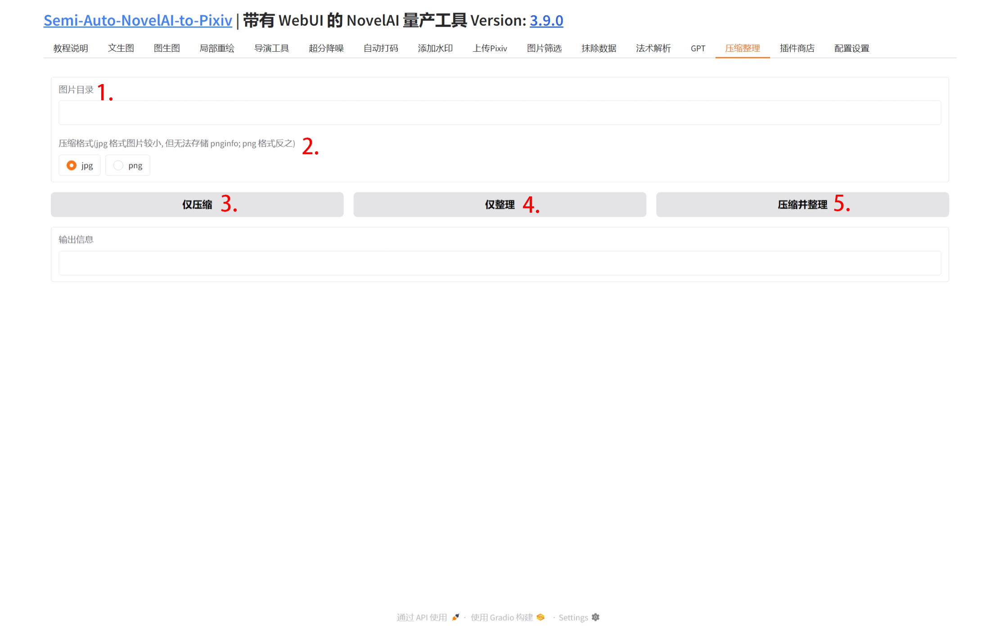

## 1. 图片目录

需要进行操作的图片目录.

## 2. 压缩格式

可以选择 jpg 或 png. jpg 图片中不能保留元数据, 反之 png 可以, 但 jpg 格式压缩后体积更小.

## 3. 仅压缩

仅对图片进行压缩.

!!!WARNING
    注意: 此操作不可逆

## 4. 仅整理

仅对图片进行整理并生成一个 Excel 表格.

## 5. 压缩并整理

压缩后对图片进行整理并生成一个 Excel 表格.
