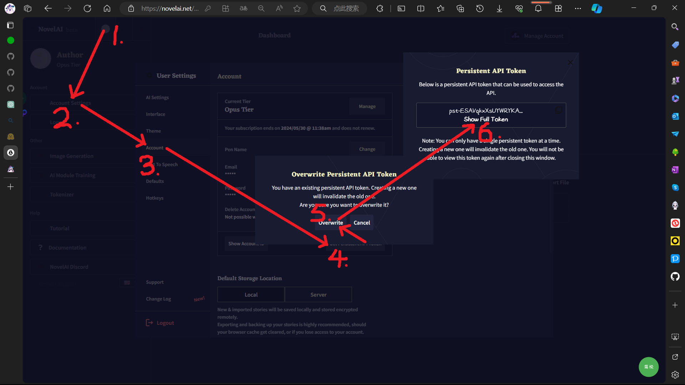
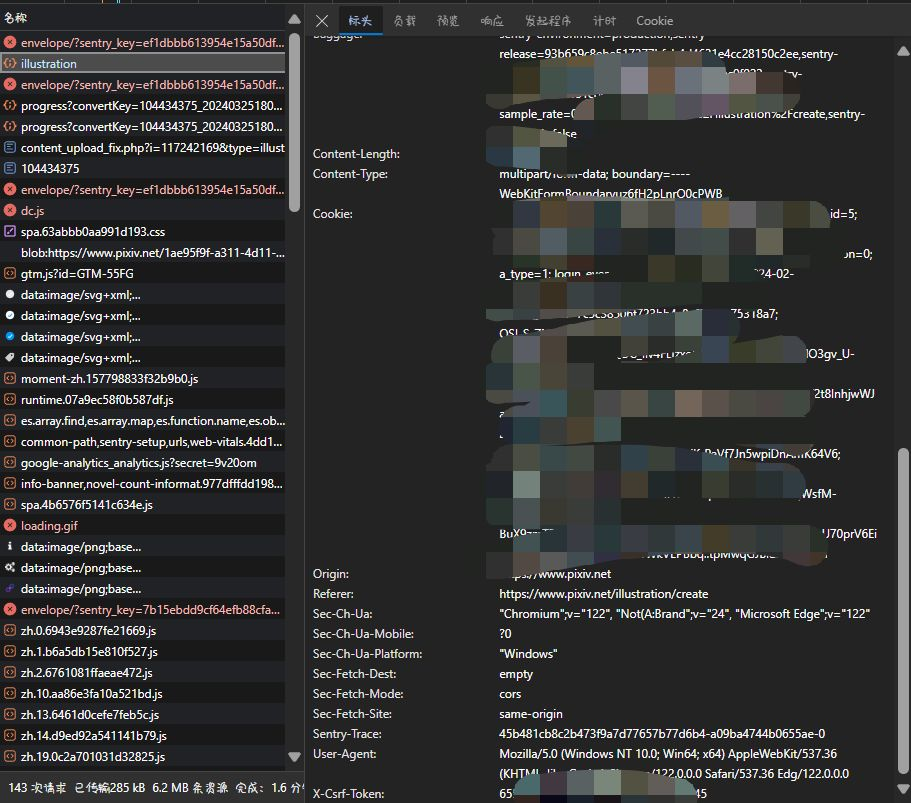

**切换到浅色页面:**

[http://127.0.0.1:11451/?__theme=light](http://127.0.0.1:11451/?__theme=light)

**切换到深色页面:**

[http://127.0.0.1:11451/?__theme=dark](http://127.0.0.1:11451/?__theme=dark)

**Novel AI token 和 Pixiv cookie 的获取方法:**

**⚠️ token 的获取:**

- 

**⚠️ pixiv_cookie 和 pixiv_token 的获取:**

- 1.打开 https://www.pixiv.net/illustration/create 并手动上传图片
- 2.选择标签, 年龄限制, AI生成作品, 公开范围, 作品评论功能, 原创作品
- 3.F12 打开控制台并切换到网络视图
- 4.点击投稿
- 5.找到并单击 illustraion, 右侧切换到标头选项
- 6.在请求头部中可以找到 Cookie 和 X-Csrf-Token
- 
