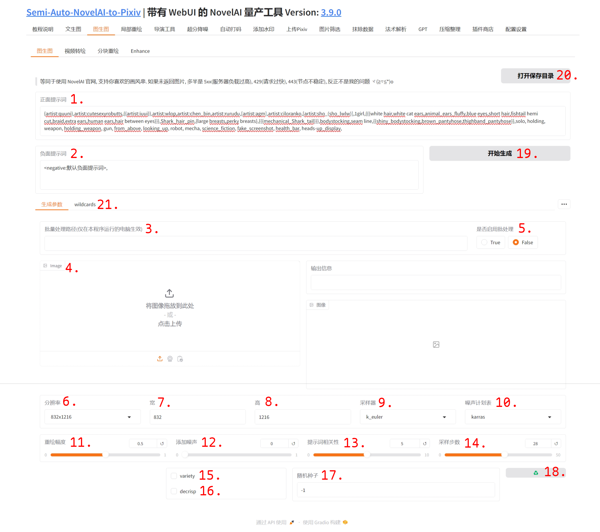
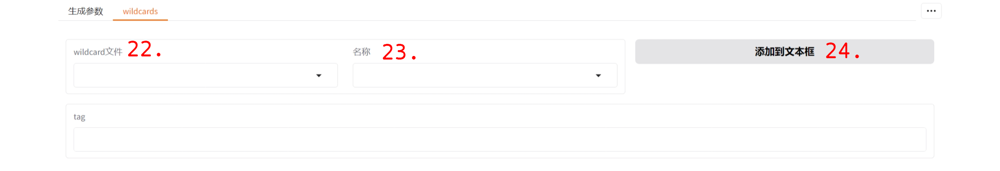

## 1. 正面提示词

在这里, 你可以输入你想画的一切!

## 2. 负面提示词

在这里, 你可以输入你一切你不想画的!

## 3. 批量处理路径

当有多张图片进行图生图时, 可以填写该路径并将"是否启用批处理"设为"True", 批量图生图的放大倍数等参数遵循配置设置中设定的值.

## 4. 图片

单张图片进行图生图时, 可以选择上传, 拍摄或粘贴一张图片到此处.

## 5. 是否启用批处理

设为 True 后, 上传单张图片无效, 会进行批量图生图.

设为 False 后, 进行单张图生图.

## 6. 分辨率

选择分辨率后, 下方的宽高输入框将自动变化.

## 7.8. 宽 & 高

当你想要的分辨率不在上方的分辨率下拉列表时, 你可以手动输入下方的**宽**和**高**来自定义分辨率.

需要注意的是, 在 NovelAI 中, 所有的分辨率数值都必须是 32 的倍数, 但你<u>**无需担心**</u>, 在生成时我会自动帮你修改为最靠近你输入的分辨率数值且为 32 倍数的分辨率(在 NovelAI 官网同样会进行此处理)!

另外, 当输入分辨率较大时, **请注意点数的消耗**.

## 9. 采样器采样器

不同的采样器将会对画风产生一定影响.

## 10. 噪声计划表

不同的噪声计划表将会对画风产生一定影响.

## 11. 重绘幅度

上传的图片的重绘幅度, 重绘幅度越大, 画面变化越大.

## 12. 添加噪声

添加噪声, noise.

## 13. 提示词相关性

该值越大, 图片内容将越符合输入的提示词; 反之, 越偏离输入的提示词.

## 14. 采样步数

在 1 至 28 步内, 步数越大, 画面越细致.

但超过 28 步后, 画面的变化极小.

同时, 在 25 🔪的会员中, 超过 28 步需要**消耗额外点数**.

## 15. variety

开启 variety 可改善画风和肢体表现等.

## 16. decrisp

开启 decrisp 可使动作更加多样性.

## 17. 随机种子输入

当需要固定种子时, 直接文本框内修改即可.

## 18. 随机种子按钮

当想切换到随机种子时, 单击 "♻️" 按钮, 将自动把左侧文本框内的内容改为 "-1".

## 19. 开始生成

点击"开始生成"后, 将按照提示词和设置的参数单张或批量生成图片.

## 20. 打开保存目录

点击按钮, 将打开图生图的保存目录.

## 21. wildcards

点击将切换到 wildcard 选项卡.

这是一个类似于 stable-diffusion-webui 中的 generate 按钮下方储存提示词的功能.

wildcard 可以帮助用户更加方便的输入 tag, 输入的 wildcard 将在生成图片时自动替换成 tag.

### 22. wildcards 文件

SANP 内置了一些 wildcard 文件, 不同的文件对应不同类别的 tag, 选择一个文件后, 右侧名称下拉列表将变为可用.

### 23. wildcards 名称

选择一个名称后, 下方的 tag 文本框将展示这个当前 wildcard 的 tag.

### 24. 添加到文本框

在选择完毕后, 点击"添加到文本框"按钮, 将自动把当前选择的 wildcard 添加到输入的正面提示词的末尾.

当选择的 wildcard 文件为 negative.yaml 时, 当前选择的 wildcard 将被添加到负面提示词末尾.
