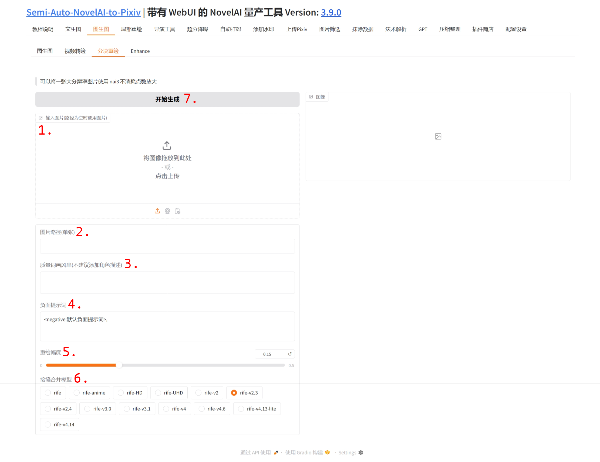

## 1. 图片上传

点击该区域上传图片或直接拖拽图片到此处.

## 2. 图片路径

在此输入单张图片路径, 相对路径或绝对路径均可.

注意, 当同时上传图片并填写图片路径时, 将优先使用图片路径.

## 3. 质量词画风串

在这里填写画风和一些质量词, 不建议填写角色或场景描述等, 防止重绘时出现一些其它东西.

## 4. 负面提示词

在这里输入一切你不想要的.

## 5. 重绘幅度

不建议超过 0.2, 否则将导致接缝比较明显.

## 6. 解封合并模型

列出的一些模型区别不是很大, 可以自行尝试.

## 7. 开始生成

开始分块重绘, 分辨率越大的图片耗时将会越长.
