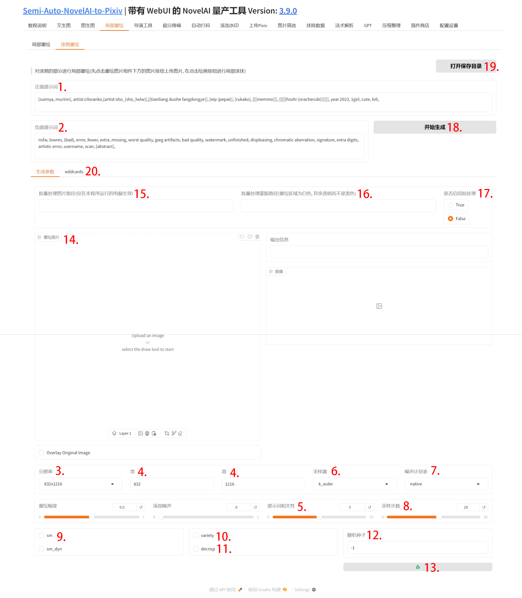
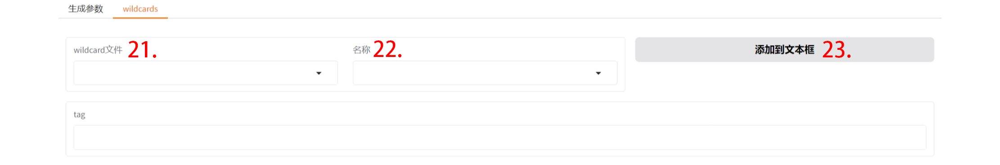

## 1. 正面提示词

在这里, 你可以输入你想画的一切!

## 2. 负面提示词

在这里, 你可以输入你一切你不想画的!

## 3. 分辨率

选择分辨率后, 下方的宽高输入框将自动变化.

## 4. 宽 & 高

当你想要的分辨率不在上方的分辨率下拉列表时, 你可以手动输入下方的**宽**和**高**来自定义分辨率.

需要注意的是, 在 NovelAI 中, 所有的分辨率数值都必须是 32 的倍数, 但你<u>**无需担心**</u>, 在生成时我会自动帮你修改为最靠近你输入的分辨率数值且为 32 倍数的分辨率(在 NovelAI 官网同样会进行此处理)!

另外, 当输入分辨率较大时, **请注意点数的消耗**.

## 5. 提示词相关性

该值越大, 图片内容将越符合输入的提示词; 反之, 越偏离输入的提示词.

## 6. 采样器

不同的采样器将会对画风产生一定影响.

## 7. 噪声计划表

不同的噪声计划表将会对画风产生一定影响.

## 8. 采样步数

在 1 至 28 步内, 步数越大, 画面越细致.

但超过 28 步后, 画面的变化极小.

同时, 在 25 🔪的会员中, 超过 28 步需要**消耗额外点数**.

## 9. sm & sm_dyn

开启 sm 后, 将对某些画风产生不同程度的影响.

sm_dyn 同理, 但开启 sm_dyn 需要同时开启 sm 才生效.

## 10. variety

开启 variety 可改善画风和肢体表现等.

## 11. decrisp

开启 decrisp 可使动作更加多样性.

## 12. 随机种子输入

当需要固定种子时, 直接文本框内修改即可.

## 13. 随机种子按钮

当想切换到随机种子时, 单击 "♻️" 按钮, 将自动把左侧文本框内的内容改为 "-1".

## 14. 图片上传

点击该区域上传图片或直接拖拽图片到此处.

上传后, 使用画笔工具涂画出想要的内容.

## 15. 批量处理图片路径

当需要批量局部重绘时填写.

## 16. 批量处理蒙版路径

批量局部重绘时各个图片对应的蒙版, 蒙版图片重绘区域为白色, 其余透明而不是黑色, 并且需要与原图片同名.

## 17. 是否启用批处理

勾选后, 进行批量局部重绘, 单张图片将不会进行局部重绘.

## 18. 开始生成

开始局部重绘或批量局部重绘.

## 19. 打开保存目录

打开局部重绘的保存目录.

## 20. wildcards

点击将切换到 wildcard 选项卡.

这是一个类似于 stable-diffusion-webui 中的 generate 按钮下方储存提示词的功能.

wildcard 可以帮助用户更加方便的输入 tag, 输入的 wildcard 将在生成图片时自动替换成 tag.

### 21. wildcards 文件

SANP 内置了一些 wildcard 文件, 不同的文件对应不同类别的 tag, 选择一个文件后, 右侧名称下拉列表将变为可用.

### 22. wildcards 名称

选择一个名称后, 下方的 tag 文本框将展示这个当前 wildcard 的 tag.

### 23. 添加到文本框

在选择完毕后, 点击"添加到文本框"按钮, 将自动把当前选择的 wildcard 添加到输入的正面提示词的末尾.

当选择的 wildcard 文件为 negative.yaml 时, 当前选择的 wildcard 将被添加到负面提示词末尾.
