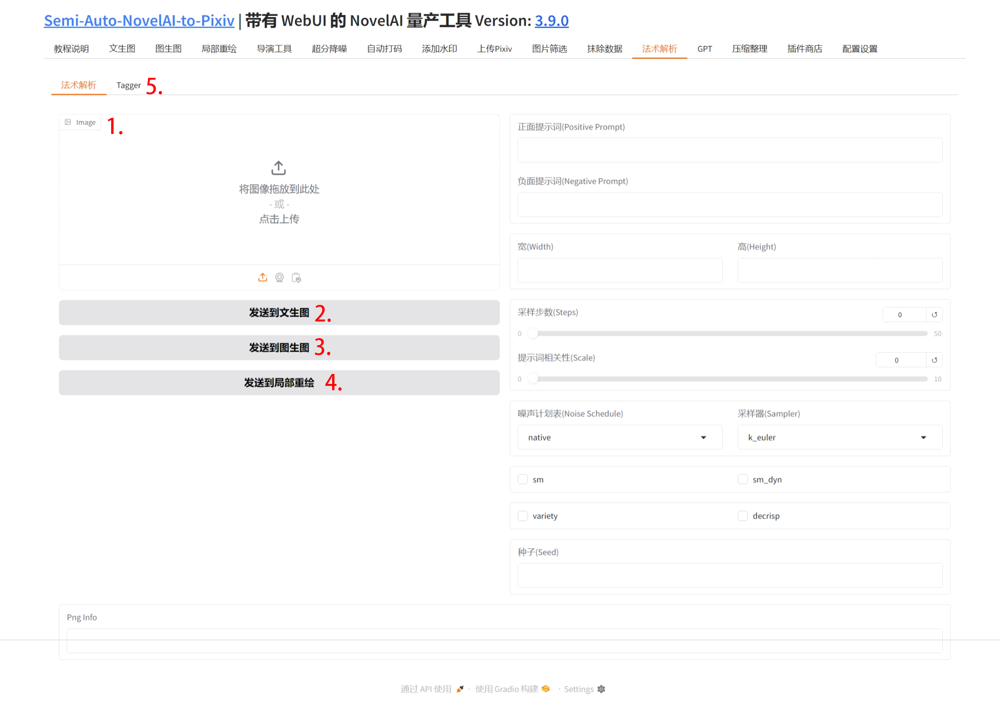
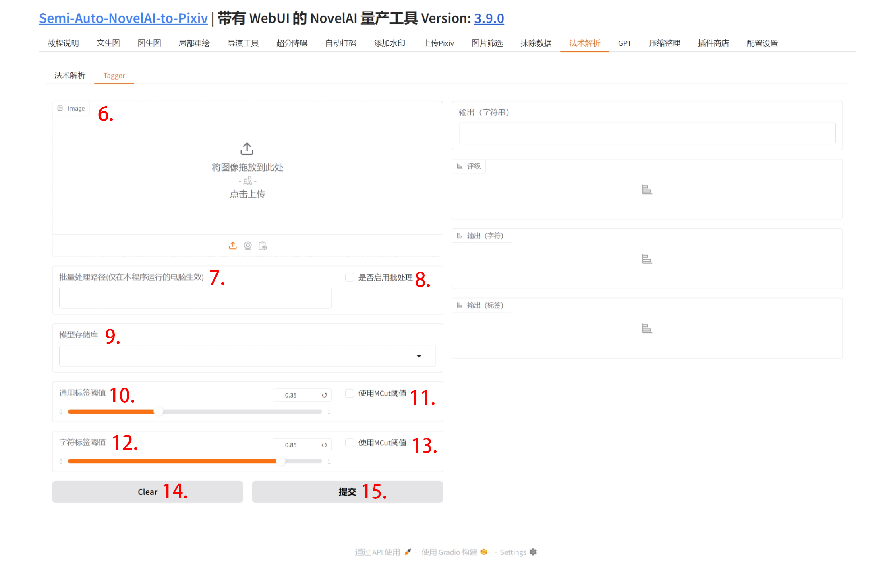

## 1. 图片上传

点击该区域上传图片或直接拖拽图片到此处, 得到的元数据将会展示在右侧和下方.

## 2. 发送到文生图

将右侧生成参数发送到文生图.

## 3. 发送到图生图

将右侧生成参数发送到图生图.

## 4. 发送到局部重绘

将右侧生成参数发送到局部重绘.

## 5. Tagger

点击切换到提示词反推选项卡.

## 6. 图片上传

点击该区域上传图片或直接拖拽图片到此处.

## 7. 批量处理路径

在此输入图片目录, 相对路径或绝对路径均可.

## 8. 是否启用批处理

勾选后, 进行批量反推, 单张图片将不会进行反推.

## 9.模型储存库

反推模型.

## 10. 通用标签阈值

## 11. 使用MCut阈值

## 12. 字符标签阈值

## 13. 使用MCut阈值

## 14. Clear

清除所有填写的内容.

## 15. 提交

开始反推.
