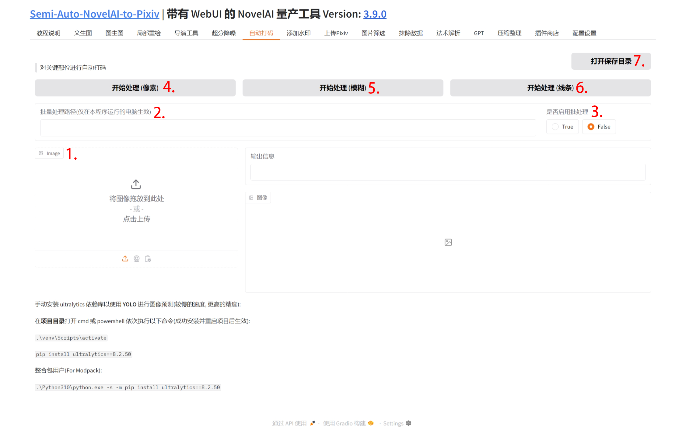

## 1. 图片上传

点击该区域上传图片或直接拖拽图片到此处.

## 2. 图片路径

在此输入图片目录, 相对路径或绝对路径均可.

## 3. 是否启用批处理

勾选后, 进行批量打码, 单张图片将不会进行打码.

## 4. 开始处理(像素)

打码使用像素块的方式.

## 5. 开始处理(模糊)

打码使用模糊关键区域的方式.

## 6. 开始处理(线条)

打码使用黑色线条的方式.

## 7. 打开保存目录

打开自动打码的保存目录.
