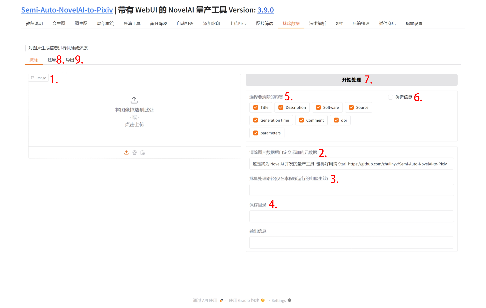
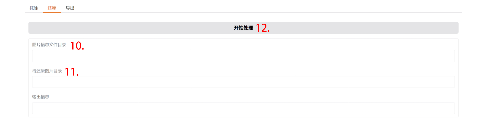
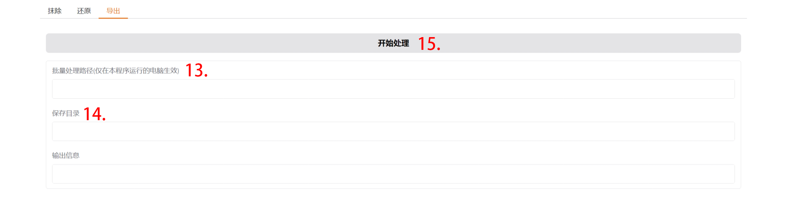

## 1. 图片

该区域不能直接拖拽上传, 需要使用下方的选择按钮.

## 16. 选择图片

选择一张图片, 选择后, 会在上方展示

## 17. 清除选择

取消选择图片, 取消后才可以进行批量处理.

## 2. 清除图片后自定义添加的数据

会将生成参数全部替换为该信息.

## 3. 批量处理路径

填写后, 进行批量处理, 上传的单张图片不会进行抹除数据的操作.

## 4. 保存目录

任意一个目录, 当与批量处理路径相同时, 清除数据后直接覆盖原图片.

!!!WARNING
    注意, 此操作不可逆

## 5. 选择要清除的内容

可以指定清除某些内容, 默认全选.

## 6. 伪造信息

勾选后, 清除数据不会写入自定义添加的数据, 而是伪造一个生成信息写入.

## 7. 开始处理

开始抹除数据.

## 8. 还原

切换到还原选项卡.

### 10. 图片信息文件目录

目录内可以是包含元数据的 *.png 或仅包含正面提示词的 *.txt.

### 11. 待还原图片目录

目录内图片应与图片信息文件目录内的图片或文本文件同名.

### 12. 开始处理

开始还原图片信息.

## 9. 导出

切换到导出选项卡.

### 13. 批量处理路径

待导出提示词图片目录.

### 14. 保存目录

提示词文件保存目录, 可与批处理路径相同.

## 15. 开始处理

开始导出提示词.

