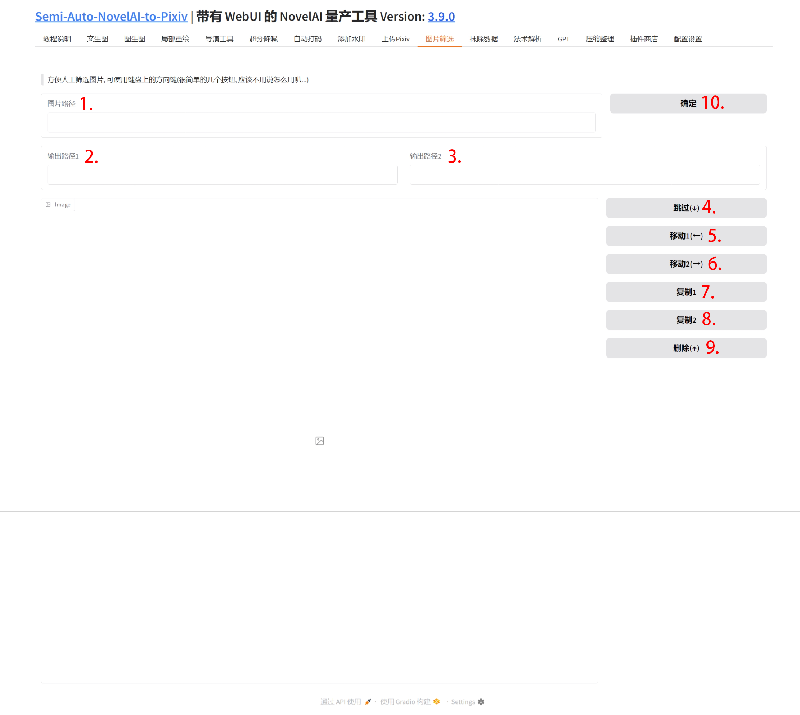

## 1. 图片路径

填写想要筛选的图片目录.

## 2. 输出路径1

第一个输出路径.

## 3. 输出路径2

第二个输出路径.

## 4. 跳过

跳过当前图片, 不执行任何操作, 按键盘上的方向"↓"键可快捷操作.

## 5. 移动1

将当前展示的图片移动到输出路径1, 按键盘上的方向"←"键可快捷操作.

## 6. 移动2

将当前展示的图片移动到输出路径2, 按键盘上的方向"→"键可快捷操作.

## 7. 复制1

将当前展示的图片复制到输出路径1.

## 8. 复制2

将当前展示的图片复制到输出路径2.

## 9. 删除

将当前展示的图片移动到回收站, 按键盘上的方向"↑"键可快捷操作.

## 10. 确定

输入图片路径后点击"确定"按钮, 展示第一张图片.
